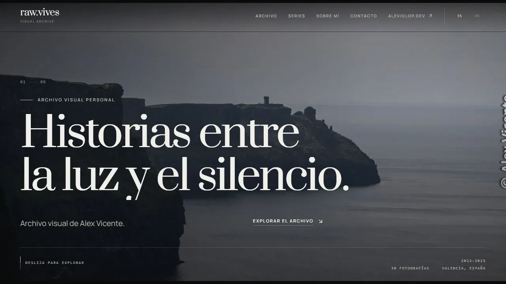

# Alex Vicente López — Portfolio

Portfolio profesional de [Alex Vicente López](https://www.aleviclop.dev), Frontend Developer centrado en React y Next.js, con experiencia en Laravel, PHP y MySQL y disponibilidad freelance en Valencia. Presenta casos de estudio, experiencia profesional y trabajo fotográfico mediante una experiencia bilingüe y accesible.

[Ver portfolio](https://www.aleviclop.dev) · [Explorar raw.vives](https://rawvives.aleviclop.dev) · [GitHub](https://github.com/AVL05) · [LinkedIn](https://www.linkedin.com/in/aleviclop/)



## Características

- Presentación profesional en español e inglés con preferencia persistente.
- Casos de estudio para interfaces frontend, aplicaciones full-stack y proyectos editoriales.
- Contenido responsive con navegación accesible y objetivos táctiles adecuados.
- Animaciones GSAP compatibles con `prefers-reduced-motion`.
- SEO localizado con canonical, sitemap, robots, Open Graph, Twitter Cards y JSON-LD.
- Formulario de contacto con validación accesible y entrega mediante Web3Forms.
- Analytics y métricas de rendimiento mediante Vercel Analytics y Speed Insights.

## Stack

| Área | Tecnologías |
| --- | --- |
| Framework | Next.js 16, App Router, React 19 |
| Lenguaje | TypeScript |
| Estilos | Tailwind CSS 4, PostCSS |
| Movimiento | GSAP, `@gsap/react`, ScrollTrigger, ScrollToPlugin |
| UI | Radix UI, Lucide, React Icons, Geist |
| Calidad | ESLint, TypeScript, Node Test Runner, Playwright |
| Plataforma | Vercel, GitHub Actions |

## Arquitectura

```text
app/            Rutas, layouts, metadata, sitemap, robots y endpoints
components/     Secciones del portfolio y componentes reutilizables
components/ui/  Primitivas compartidas de interfaz
hooks/          Hooks reutilizables de React
lib/            Idiomas, SEO, GSAP y utilidades comunes
lib/locales/    Catálogos de contenido en español e inglés
public/         Imágenes, documentos, favicon y recursos publicados
tests/          Pruebas de integración y contratos del producto
tests/e2e/      Flujos de navegador con Playwright
docs/           Documentación técnica específica
```

La aplicación mantiene separadas las responsabilidades de presentación, estado bilingüe, animación y SEO. Las rutas públicas reutilizan los helpers de `lib/seo.ts` para conservar canonicals y metadata coherentes.

## Rutas principales

| Ruta | Contenido |
| --- | --- |
| `/` | Portfolio completo |
| `/sobre-mi` | Perfil profesional |
| `/proyectos` | Índice de proyectos |
| `/proyectos/raw-vives` | Caso de estudio de raw.vives |
| `/proyectos/lumaflow-studio` | Caso de estudio de LumaFlow Studio |
| `/proyectos/distrito-gourmet` | Caso de estudio de Distrito Gourmet |
| `/fotografia` | Perfil y archivo fotográfico |
| `/contacto` | Información de contacto |
| `/legal` | Aviso legal y privacidad |

## Requisitos

- Node.js 22.x
- pnpm 10.x

## Instalación y desarrollo

```bash
pnpm install --frozen-lockfile
pnpm dev
```

El servidor de desarrollo usa webpack. La aplicación estará disponible en la URL indicada por Next.js.

## Comandos

| Comando | Descripción |
| --- | --- |
| `pnpm dev` | Inicia el entorno local de desarrollo |
| `pnpm lint` | Ejecuta ESLint sobre el repositorio |
| `pnpm typecheck` | Valida TypeScript sin emitir archivos |
| `pnpm test` | Ejecuta las pruebas de integración con `node:test` |
| `pnpm test:e2e` | Ejecuta los flujos E2E de Playwright |
| `pnpm build` | Genera el build optimizado de producción |
| `pnpm start` | Sirve un build de producción existente |

## Validación

Antes de publicar cambios deben completarse estas comprobaciones:

```bash
pnpm lint
pnpm typecheck
pnpm test
pnpm build
pnpm test:e2e
```

Las pruebas cubren paridad ES/EN, contratos SEO, recursos publicados, accesibilidad básica, navegación, cambio de idioma, formulario de contacto y comportamiento responsive.

## SEO y descubrimiento

El portfolio expone:

- metadata localizada y URL canonical bajo `www.aleviclop.dev`;
- datos estructurados `Person`, `WebSite` y `ProfilePage`;
- `robots.txt` abierto a rastreadores y referencia al sitemap;
- `sitemap.xml` con todas las rutas públicas indexables;
- favicon público y estable en `/favicon.png`;
- enlaces internos a las páginas de perfil, proyectos, fotografía y contacto.

Los motores de búsqueda mantienen índices independientes. La publicación técnica facilita el descubrimiento, pero la incorporación y posición final dependen de cada buscador.

## Despliegue

Los cambios enviados a `main` activan GitHub Actions y la integración de Vercel. El workflow de CI ejecuta lint, tipos, tests, build y Playwright; Vercel construye y publica la aplicación mediante su integración con el repositorio.

La URL canónica puede configurarse mediante `NEXT_PUBLIC_SITE_URL`; si no se define, se usa `https://www.aleviclop.dev`.

## Seguridad y contenido

- No deben versionarse archivos `.env`, secretos, fotografías RAW ni exportaciones temporales.
- Los recursos publicados deben residir en `public/` y estar referenciados por el código o la documentación.
- El contenido, código, diseño e imágenes pertenecen a Alex Vicente López salvo indicación expresa.

## Licencia y contacto

Consulta [LICENSE.md](LICENSE.md) para conocer las condiciones de uso.

Contacto profesional: [alexviclop@gmail.com](mailto:alexviclop@gmail.com)
